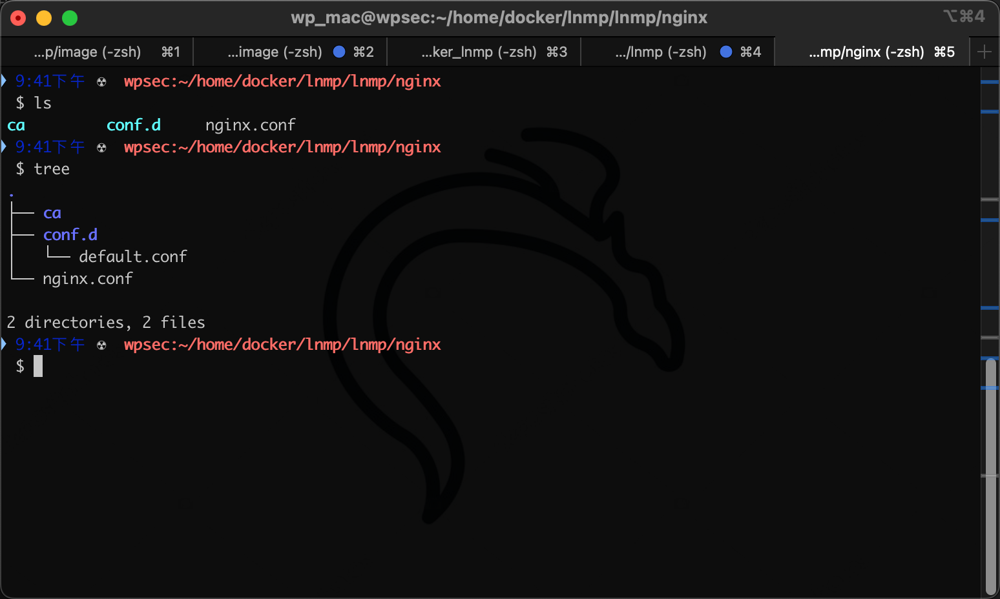
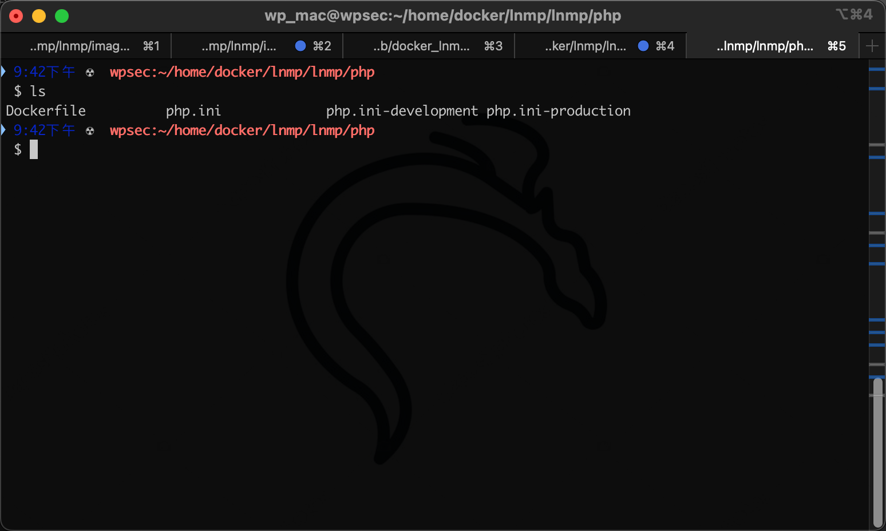
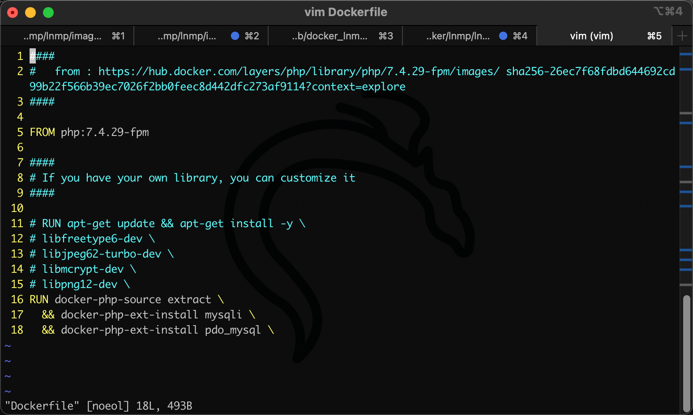
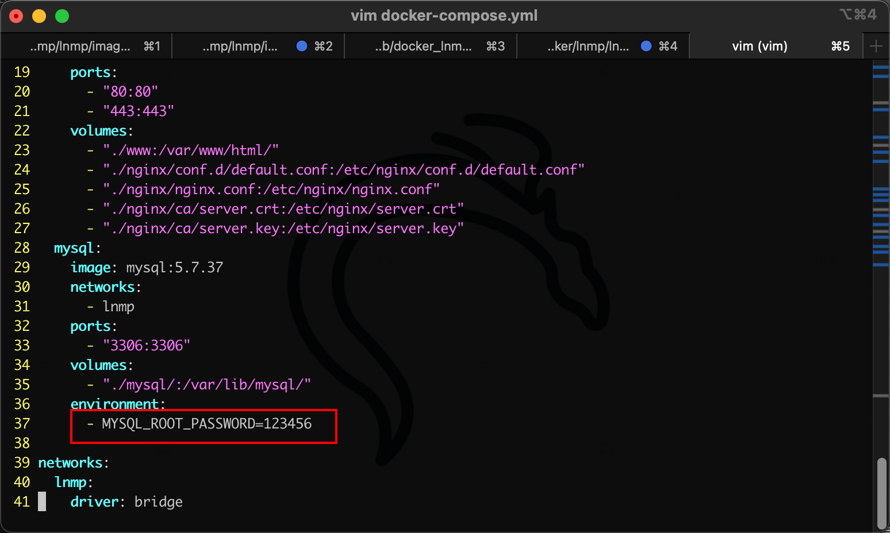
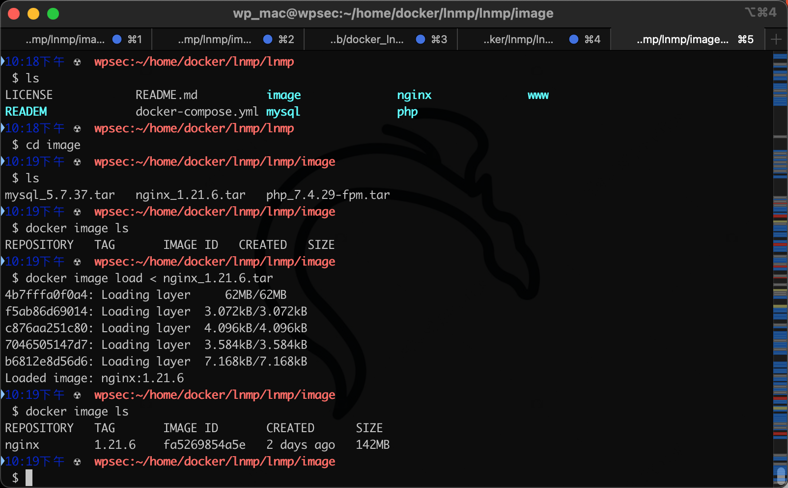
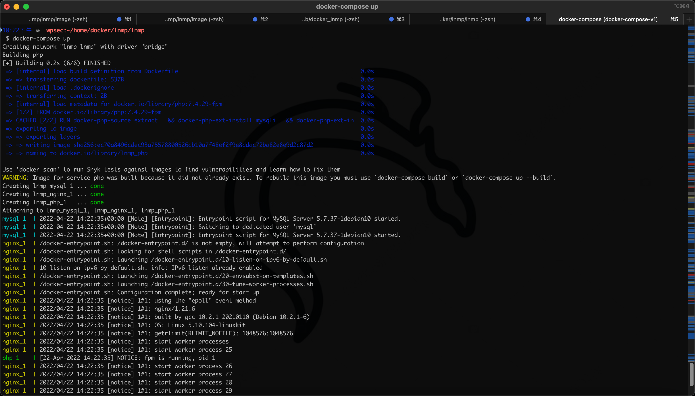
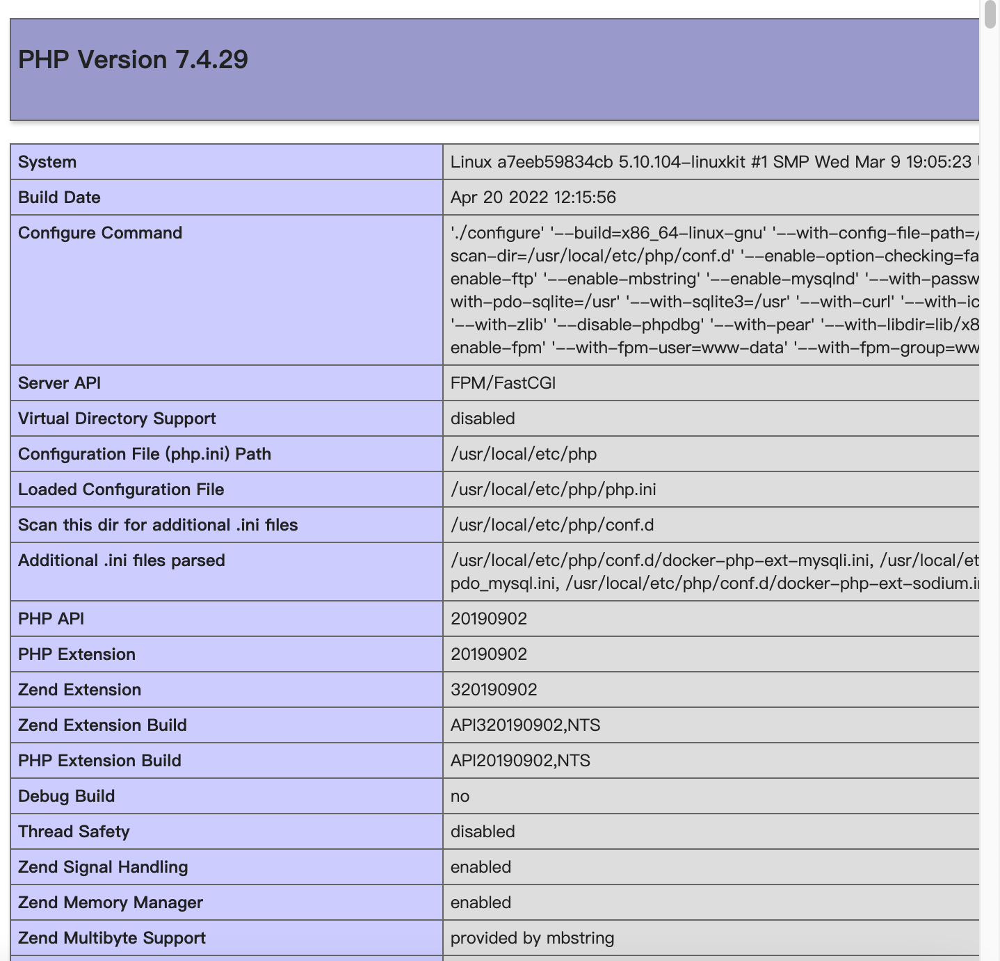

# docker_lnmp

基于docker官方镜像编排的lnmp，使用docker-compose构建

# 目录结构

<br/>

```
.
├── READEM
│   └── image
├── image
├── mysql
├── nginx
│   ├── ca
│   │   ├── server.crt
│   │   └── server.key
│   └── conf.d
├── php
└── www
```

<br/>

## nginx 配置文件

<br/>



<br/>

## php 配置文件

<br/>



<br/>

其中，dockerfile中可编辑和添加php扩展

<br/>



<br/>

## mysql

mysql目录为空，在跑docker-compose时会通过 volumes 映射 /var/lib/mysql/ 目录下的数据库文件

<br/>

mysql初始化变量可修改为你项目的数据库密码



<br/>

<br/>

# 如何食用

<br/>

1. 如果你网络状况良好，可直接通过dockerhub拉去官方镜像，在跑docker-compose时会自动操作，你可以忽略，或者你可以修改docker-compose.yml对应image版本，拉取你想要的镜像并构建。
2. 我在image目录下放了对应版本的docker包，它们对应的版本分别是
   1. mysql@v5.7
   2. php@v7.4
   3. nginx@v1.21
   
   你可通过导入镜像在本地，在本地跑 docker-compose
3. 如何导入
   
   download该项目
   ```
   cd image
   docker image load < nginx_1.21.6.tar
   ...
   ```
   
   

<br/>

4. 在导入好镜像后直接跑 docker-compose 即可
   
   
   
   
